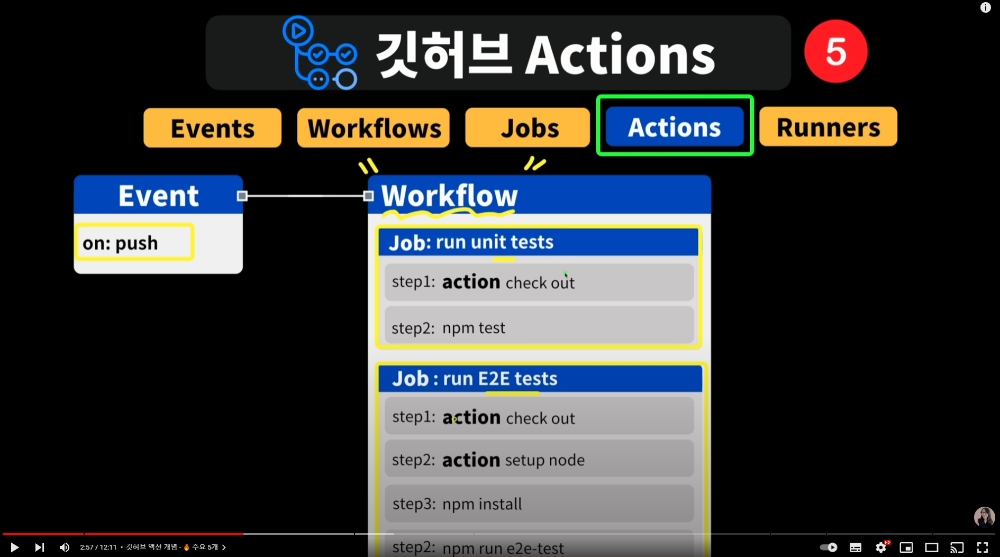
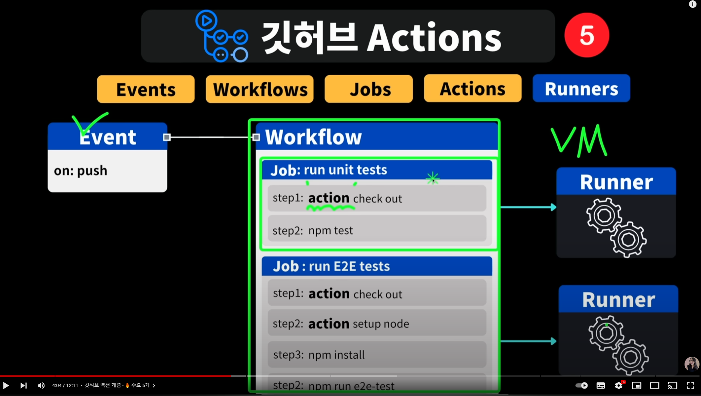
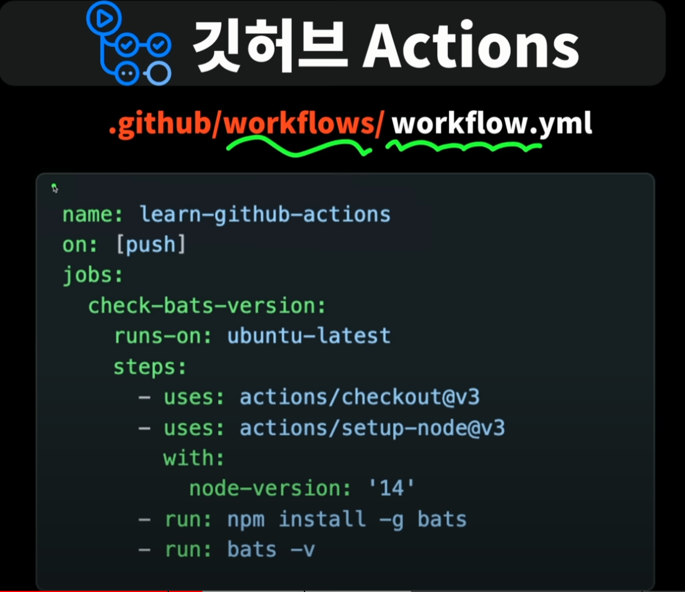
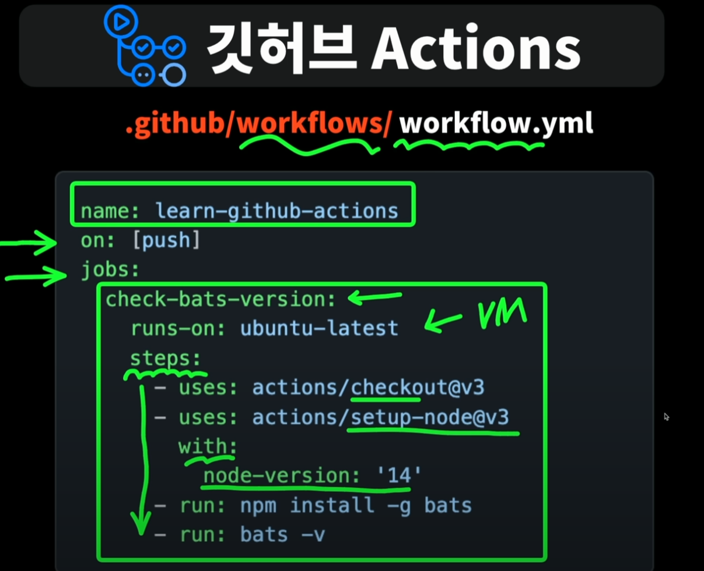

# github_actions_memo

github_actions_memo

## 5가지의 개념

### Events

어떤일이 발생햇는지를 지정할 수 있는 Events
ex: (on: push)
main branch로 merge
커밋을 푸쉬
이슈를 누군가 열면

### Workflows

(비유상의 요리책)  
어떤 조건이 충족됐을때 수행할 행동들을 정의하는 곳
Workflows안에 Job들을배치  
하나 이상의 job을 배치할 수 있음  
기본적으로는 job들이 병렬적으로 동시에 수행이됨  
(순차적으로 실행되게 만들수도 있음)

### Jobs

한개의 job 내에는 여러개의 step이 있음
step에는 sh명령어를 실행 할 수도 있고
github에서 짠 action을 실행 할 수도 있음

### Actions

step이 필요한 자리에 사용  
공개적으로 많은 action들이 이미 정의되어 있음
ex:  
(action setup node) => 노드를 쓸 수 잇는 환경을 구성해줌

### Runners

job을 실행하는 것이 runner  
보통은 VM(가상머신)이거나 docker container라고 볼 수 있음

## (실제) 사용법

github action을 사용하기 위해서는
프로젝트내에
`.github/workflows/`가 있어야함
그 내부에 yml파일을 만들어준다. (이 파일이 workflows폴더 내부에만 있으면 된다.)
ex:
`.github/workflows/workflow.yml`  
대략적인 생김새 예시

on 자리에 이벤트 명시  
jobs에 어떤 일이 실행될 지를 명시  
jobs 바로밑에는 job을 적고

job바로아레에는 runs-on으로 희망가상환경을 정의해주기
job아래에 steps들을 적어주기

steps아래에 하나하나 적어주기

